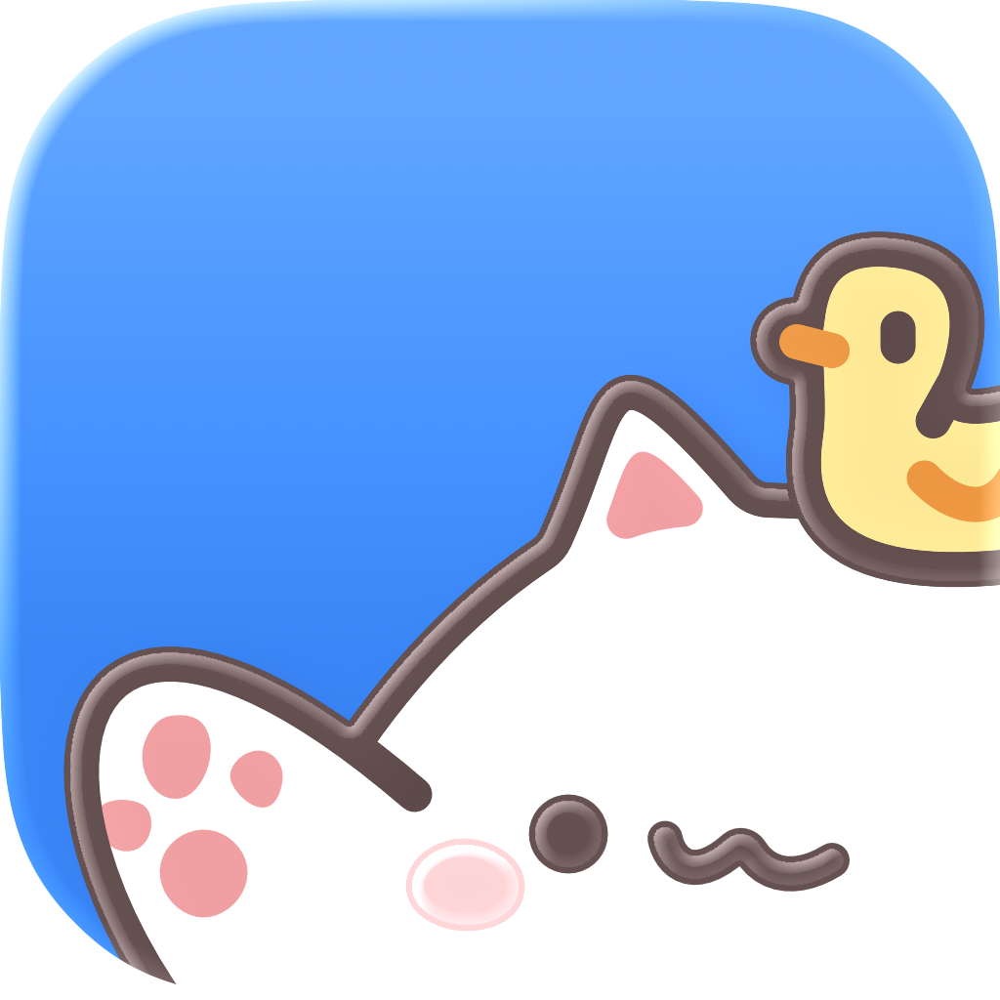

<h3 align="center">Tapling <i>by <a href="https://builder.group/">builder.group</a></i></h3>

   Your delightful keyboard companion that taps along while you type.
     
    <a href="https://tapling.app/"><strong>Learn more »</strong></a>
     
     
     
     
     
     
     

 

## Introduction

**Tapling** is a keyboard companion for iOS that taps along while you type. Earn keycaps, open cardboxes, unlock cosmetics, and turn everyday typing into a tiny progression loop.

Type anywhere → Tapling taps → Earn keycaps → Buy cardboxes → Customize + Progress → Repeat

No account. No cloud. No analytics. Tapling data stays on your device.

Tapling is open source under [AGPL-3](./LICENSE) and currently free. Better keyboard support, especially autocomplete and autocorrect, may need funding if enough people want it.

## Download

**[iOS (tapling.app)](https://tapling.app/)** · [App Store](https://apps.apple.com/us/app/tapling-type-with-bongo-cat/id6756097345)

## The Tapling

The Tapling is composed of layered SVG assets for furs, hats, and faces. Want to create your own cosmetics? Grab the [Figma file](https://www.figma.com/community/file/1632645156337158294) and contribute hats, furs, or faces.

Inspired by the Bongo Cat meme, artwork by [@StrayRogue](https://twitter.com/StrayRogue), and the [Bongo Cat Steam game](https://store.steampowered.com/app/3419430/Bongo_Cat/). This is a fan project made with respect for what they built.

## Tech Stack

- **iOS App** - Native Swift/SwiftUI
- **Web** - TanStack Router, React, TypeScript, Vite

## Contributing

Contributions are welcome. If you have an idea, found a bug, want better keyboard support, or want to add new cosmetics, open an issue first so we can discuss it.

For questions, feedback, or cosmetic ideas, [join the Discord](https://discord.com/invite/w4xE3bSjhQ).

## License

This repository is licensed under [AGPL-3](./LICENSE), unless otherwise noted.
